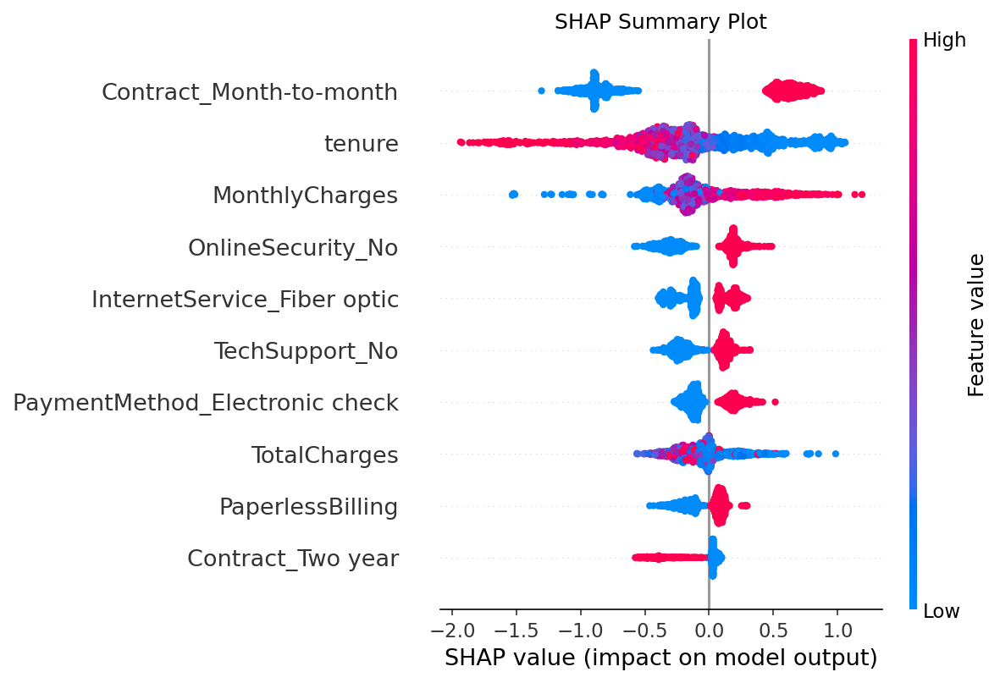
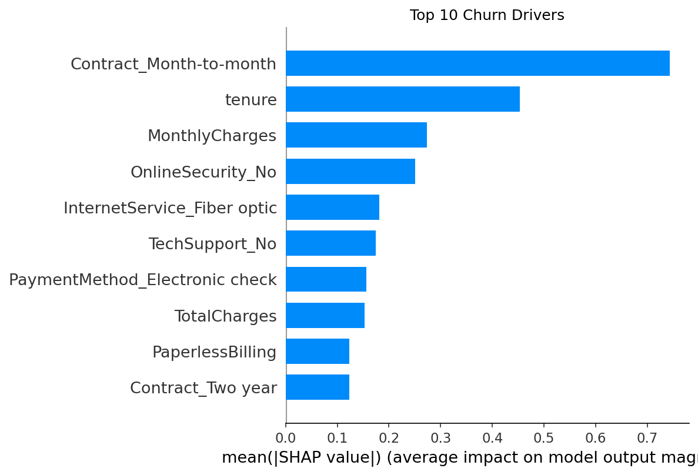

# 🔍 Customer Churn Prediction

An end-to-end machine learning pipeline to predict customer churn using the **IBM Telco Customer Churn dataset** (7,043 records, 21 features). Covers data cleaning, feature engineering, model training, and SHAP explainability.

---

## 📊 Key Results

| Metric | Score |
|--------|-------|
| ROC-AUC | **0.84** |
| Accuracy | **80%** |
| Dataset size | 7,043 records |
| Features | 21 |

**Top churn drivers:** month-to-month contracts · low tenure · high monthly charges · lack of online security

---

## 📈 SHAP Explainability





---

## 💡 Business Insight

> Customers on **month-to-month contracts churn at 43%** — compared to just **3% on two-year contracts**.  
> Targeted retention strategies for this segment could significantly reduce revenue loss.

---

## 🛠️ Tech Stack


---

## 🚀 How to Run

**1. Clone the repo**
```bash
git clone https://github.com/vidit18s/churn-prediction.git
cd churn-prediction
```

**2. Install dependencies**
```bash
pip install xgboost shap scikit-learn pandas numpy matplotlib seaborn
```

**3. Open the notebook**
```bash
jupyter notebook churn_analysis.ipynb
```

Run all cells from top to bottom.

---

## 📁 Project Structure
```
churn-prediction/
│
├── churn_analysis.ipynb           # Main notebook
├── shap_summary.png               # SHAP summary plot
├── shap_feature_importance.png    # Feature importance chart
├── churn_distribution.png         # Churn distribution chart
└── README.md
```

---

## 📂 Dataset

[IBM Telco Customer Churn — Kaggle](https://www.kaggle.com/datasets/blastchar/telco-customer-churn)

---

*Personal project — independently designed and built*
